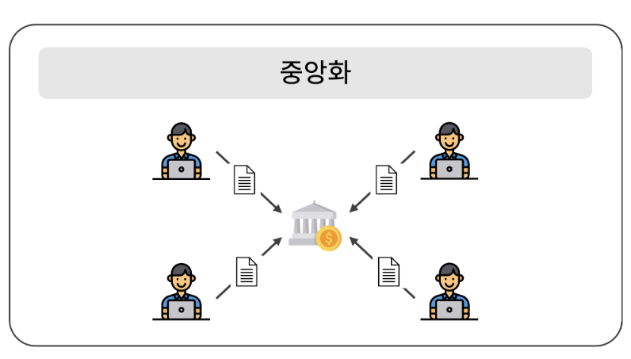
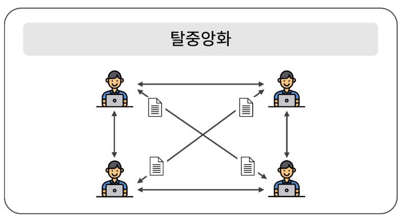
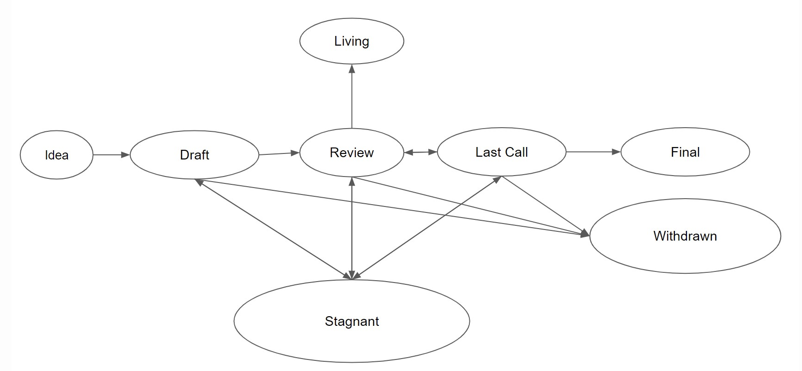

# NFT 개발 스타터팩 내용 정리


## 1. 분산화 시스템
### 중앙화 시스템



- 모든 정보가 한 곳에 집중되며 그곳에만 의사결정권한 존재

    ⇒ 시스템 통제가 쉬움
    
- 소수에 의해 모든 거래가 관리됨
    
    ⇒ 보안 문제에 취약

### 탈중앙화 시스템(분산화 시스템)



- 의사결정권한이 중앙기관에 집중되는 대신, 모든 노드가 피어(peer)로 연결되며 P2P 방식으로 데이터를 공유하는 신뢰 기반 시스템
    <aside>
    #피어(Peer) : 동등한 권리와 역할을 가지는 노드
    </aside>
 
- 거래 정보를 모두가 볼 수 있게 공개하고 이를 함께 관리하고 감시

    ⇒ 신뢰 문제 해결    
    ⇒ 감시기관을 운영하는 비용 절감

## 2. 블록체인

- 분산화 시스템을 관리하는 분산 컴퓨팅 기술
- ‘블록’이라고 하는 소규모 데이터들을 P2P 방식으로 체인처럼 연결하여, 시스템에 참여하는 누구나 데이터를 추가할 수 있도록 한다.

    <aside>
    #암호화폐 : 블록체인 기술을 이용한 분산화 시스템 기반의 서비스 중 하나.
    </aside>

- 정보 전달 과정에서의 시간차로 인한 동기화 문제를 방지하기 위한 규칙 제공
    
    > 규칙1. 상태 변경 정보가 담긴 대기 형태의 ‘트랜잭션’ 단위로 데이터가 생성된다.
    > 
    > 
    > 규칙2. 트랜잭션은 일정 시간 동안 쌓여 블록을 이룬다.
    > 
    > 규칙3. 블록체인 내의 모든 노드는 같은 블록을 공유받고, 그 블록이 포함한 트랜잭션을 가지고 상태를 업데이트한다.
    > 


   
    블록들은 블록체인 내에서 ‘이전 블록 해시’로 서로 연결된다.
    n번째 블록을 수정하면 n번째 이후 모든 블록이 변경된다.
    ⇒ 장부(트랜잭션과 블록)의 위조 및 변조가 어렵다.


<aside><b>
❗ 모든 노드에서 같은 데이터를 전달받아 업데이트하므로 시스템 전체는 동기화 문제가 해결된 상태로 신뢰가 유지된다.
</b></aside>

## 3. 이더리움

- 블록체인 기술을 활용하여 스마트 콘트랙트 기능을 구현할 수 있도록 하는 분산화 서비스
- 이더 또는 ETH로도 표기하는 자체 통화명이다.
    
    <aside>
    #스마트 콘트랙트
    
    - 블록체인 상에 조건이 만족되면 자동으로 내용이 실행되도록 원하는 정보를 CRUD(Create, Read, Update, Delete) 할 수 있게 하는 애플리케이션 또는 프로그램
    
    #디앱
    
    - 스마트 콘트랙트를 웹 또는 앱과 연동한 시스템
    </aside>
    

### (1) 암호화폐

- 기존의 블록체인 서비스
- 단순히 화폐의 보유량만 저장하고 관리

### (2) 이더리움

- 암호화폐를 다룰 뿐만 아니라 스마트 콘트랙트로 다양한 디앱을 개발할 수 있도록 함
    
    ⇒ 여러 형태의 데이터를 블록체인 기반으로 관리 가능
    

<aside>
❗ 이더리움은 디앱의 플랫폼을 정의하는 일련의 프로토콜이자 구동하는 운영 기술

</aside>

### (3) EIP (Ethereum Improvement Proposal, 이더리움 개선 제안)
<aside>
    ❗ EIP로 이더리움의 핵심 프로토콜 사양, 클라이언트 API  및 콘트랙트 구조를 포함한 이더리움 플랫폼의 표준을 제안
</aside>

- 이더리움에 제안된 모든 EIP를 수용할 수 없으므로 EIP를 여러 단계로 나누어 관리
    
    
    EIP 상태 전이 과정
- EIP의 주제는 Core, Networking, Interface, ERC, Meta, Informational로 세분화된다.
    - ERC (Ethereum Request for Comment)
        
        <aside>
        ❗ 개발자는 Final 단계의 ERC를 기반으로 스마트 콘트랙트를 구현하여 토큰 발행
        </aside>
        
        - 토큰 표준, URI 체계, 라이브러리와 패키지 형식 및 지갑 형식과 같은 스마트 콘트랙트 표준에 대한 제안
        - ERC로 제안된 표준에는 ERC-20, ERC-165, ERC-721, ERC-1155 등 다양한 것들이 있다.
            
            <aside>
            #표준 : 해당 스마트 콘트랙트를 어떤 목적을 가지고 사용하자는 약속
            
            Ex ) 대체 가능한 토큰을 발행하기 위해서 ERC-20 표준을 지킨 스마트 콘트랙트를 생성해야 한다.
            
            Ex ) 대체 불가능한 토큰을 발행하기 위해서 ERC-721 표준을 지킨 스마트 콘트랙트를 사용해야 한다.
            
            #표준에 따라 포맷이 다름<br>
            ⇒ 담는 데이터의 형태도 조금씩 다름<br>
            ⇒ 각 표준의 인터페이스로 변수명, 변수 타입, 함수명, 매개변수 타입, 함수의 반환 타입, 이벤트명, 이벤트의 매개변수 타입 등을 정의
            </aside>
            

### (4) 이더리움 네트워크

- 이더리움에는 독립된 여러 네트워크가 있음
- 메인 네트워크 : 이더리움의 네트워크 중 거래소와 연동되어 있는 네트워크
- 이더리움 네트워크에서 노드를 생성 시 게스, 가나슈 CLI와 같은 소프트웨어를 사용
    - 게스 : 고(Go) 언어로 만들어짐, 이더리움 네트워크에서 노드를 운용할 수 있게 함
    - 가나슈 CLI : 테스트용 가상 네트워크에서 노드를 구축할 수 있도록 함, 스마트 콘트랙트를 테스트할 때 게스로 매번 노드를 구축해야 하는 번거로움을 줄일 수 있음


## 4. 스마트 콘트랙트

- 이더리움 같은 블록체인 기반 플랫폼에서 조건이 만족되면 자동으로 내용이 실행되도록 하는 시스템

> 자판기의 예시에 빗대어보면…
> 
> - 이더리움 : 자판기를 만드는 회사
> - 스마트 콘트랙트 : 일반 자판기
> - 디앱을 다양한 기술이 접목된 자판기  ex) 라면 끓여주는 자판기

### (1) 구조

- 객체 형태

```jsx
//스마트 콘트랙트의 구조
{'주소1' : 주소 1의 상태}  //주소 : 상태에 접근할 수 있도록 하는 고유한 값
{'주소2' : 주소 2의 상태}
```

- 이더리움은 지갑과 스마트 콘트랙트로 상태를 관리하기 위해 value, nonce, data, code 필드로 이루어진 객체를 사용한다.
    - value : 이더 보유량
    - data : 스마트 콘트랙트에서 관리하는 데이터
    - code : 스마트 콘트랙트의 코드
    - nonce : 해당 주소에서 몇 개의 트랜잭션을 생성했는지

```jsx
//이더리움 네트워크에 참가하고 있는 노드들의 상태 관리 형태
//스마트 콘트랙트의 기능에 따라 data 필드에 담길 정보가 바뀐다.
{
	value : 0,
	nonce : 0,
	data : 0x123123,
	code : 0x123123
}
```

- 이더리움 네트워크에서의 트랜잭션은 객체의 상태를 변경하고자 하는 요청으로 2가지 요청을 보낼 수 있다.
    - value 값 변경 : 이더 저송
    - data 값 변경 : 스마트 콘트랙트의 상태 변경

### (2) 개인키와 공개키

- 이더리움은 개인 계정을 제어하기 위해 개인키와 공개키를 이용한다.

```jsx
//이더리움 주소 생성 과정
1. 64자리의 무작위 숫자로 구성된 개인키 생성
	//개인키 : 단순히 무작위로 추출된 숫자
	//				 이더를 지출하는 트랜잭션을 생성할 때 디지털 서명에 사용(이더의 소유권 입증)
2. 암호화 알고리즘이 개인키로부터 공개키를 생성
	//공개키 : 이더를 수신할 수 있는 주소로 사용
	//				 계정을 식별하는 역할
3. 공개키를 해싱하여 뒤에서 40자리를 주소로 지정
```

### (3) EOA와 CA

- 이더리움에서 계정은 객체의 기능에 따라 EOA와 CA로 나뉜다.

- EOA
    - 일반적인 사용자 계정
    - 개인키 정보 포함<br>
    ⇒ EOA로만 객체의 데이터 변경 가능
    - 스스로 트랜잭션을 발생시킬 수 있는 권한을 가지며 이더 보유량 관리
    
    <aside>
        보통 EOA를 지갑 주소라고 부른다.
    </aside>
    

- CA
    - 개인키 정보를 갖지 않음
    - 이더 보유량 이외의 데이터를 별도로 저장 가능
    - 직접 트랜잭션 생성할 수 없음
    
    <aside>
        스마트 콘트랙트에 부여되는 주소가 CA이다.
    </aside>
    
- CA에 대한 변경이 필요하다면 EOA에서 CA를 대상으로 트랜잭션을 발생시켜야 한다.
- CA는 외부의 EOA에서 전달한 메시지에 대한 응답으로 자신의 코드를 수행한다.<br>
⇒ CA의 nonce 값은 항상 0

```jsx
{
	//EOA 기반의 계정 정보
	'주소 1' : {
		value : 0,
		nonce : 0,
		data : null,
		code : null
	},
	
	//CA 기반의 계정 정보
	'주소 2' : {
		value : 0,
		nonce : 0,
		data : 0x123123,
		code : 0x123123
	},
}
```

### (4) 개인키 관리 기법

```jsx
//실제 개인키의 형태
6d3bb88667f62c1edef0ac520ac2049f58af8f30353ff73d819357dffb6dd337
```

- 개인키는 16진수 형태로 이루어져 있다.
- 이더리움에서 개인키가 자산을 관리할 수 있는 권한을 주므로 특별한 관리 기법이 필요하다.
    
    > 개인키 관리 기법
    > 
    > 1. 니모닉
    >     - 무작위한 12개의 단어로 개인키 관리
    >     - 같은 니모닉은 항상 같은 주소를 조회하며 계증적인 구조로 이루어져 있다.
    > 2. 키스토어
    >     - JSON 형태로 개인키를 관리


## 5. 블록체인 활용 도구

<aside>
    지갑에서 트랜잭션을 발생시켜 이더리움 전송 또는 스마트 콘트랙트의 상태 변경을 요청한다.

</aside>

### (1) 지갑

- 이더리움 지갑은 암호화폐를 보유하고 상태를 조회할 수 있도록 하는 애플리케이션
- 지갑에서 계정을 생성하고 트랜잭션을 발생시켜 암호화폐를 전송할 수 있다.
- Ex) 메타마스크(MetaMask)

### (2) 웹3(Web3)

- 트랜잭션을 특정 네트워크로 전달하는 역할을 한다.
- 분산화된 네트워크 구조이며 자바스크립트나 파이썬, PHP 등의 언어에서 라이브러리 형태로 제공됨
- 트랜잭션을 생성하고 노드에 전달하는 역할을 하며 블록체인 환경에서 상태 조회와 주소 생성 등 여러 가지 기능을 수행한다.

### (3) 거래소

- 토큰 거래소
    - Ex ) 오픈씨 : NFT 게임 아이템을 포함한 디지털 자산의 거래를 지원한다.

<aside>
블록체인 자체는 파일을 저장하기에 부적합하므로 IPFS라는 별도의 시스템을 이용하여 파일 데이터를 다룬다.

</aside>

---

## 트랜잭션 정보

```jsx
{
	blockHash: null,    //트랜잭션이 포함된 블록의 해시
	blockNumber: null,  //트랜잭션이 포함된 블록의 번호
	from: "0x5983...",  //트랜잭션을 발생시킨 EOA
	gas: 21000,         //얼마나 코드를 실행해야 하는지
	gasPrice: 21000,    //1 gas당 할당된 금액(수수료 : gas * gasPrice)
	hash: "0x438...",   //트랜잭션의 해시
	input: "0x",        //실행할 스마트 콘트랙트의 바이트코드
	nonce: 8,           //해당 EOA에서 몇 번째로 발생시킨 트랜잭션인지
	r: "0x9566...",     //EOA에 매핑된 개인키로 서명한 결과
	s: "0x192aa...",    //EOA에 매핑된 개인키로 서명한 결과
	to: "0x2c08...",    //스마트 콘트랙트 실행 대상의 주소
	transactionIndex: null,  //해당 트랜잭션이 블록에서 몇 번째인지
	v: "0x37",          //EOA에 매핑된 개인키로 서명한 결과 
	value:123           //전송하고자 하는 이더 수량
}
```

<aside>
트랜잭션의 to 값이 CA라는 것은 토큰을 전송했다는 것을 의미하며, EOA라는 것은 이더리움을 전송했다는 것을 의미한다.

</aside>