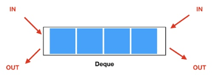

# 01-1. 자료구조에 대한 기본적인 이해

## 1. 자료구조

- 자료구조 : ‘데이터의 저장’을 담당하는 것

- 자료구조의 분류

    |선형구조|비선형구조|파일구조|단순구조|
    |:---:|:---:|:---:|:---:|
    |리스트|트리|순차파일|정수|
    |스택|그래프|직접파일|실수|
    |큐||색인파일|문자|
    ||||문자열|

# 01-2. 알고리즘의 성능분석 방법

## 1. 알고리즘

표현 및 저장된 데이터를 대상으로 하는 문제의 해결 방법

최적 : 적은 메모리 사용, 빠른 속도

## 2. 시간 복잡도와 공간 복잡도

알고리즘을 평가하는 요소

1. 시간복잡도
    
    속도에 해당하는 알고리즘의 수행시간 분석결과
    
    연산의 횟수를 통해서 알고리즘의 빠르기 판단
    
    알고리즘 별 연산 횟수를 함수의 형태로 구성하여 데이터 수의 증가에 따른 연산횟수의 변화 정도 파악 ⇒ 둘 이상의 알고리즘 비교에 용이
    
    <aside>
    데이터의 수가 많아짐에 따른 연산횟수의 증가 정도
    
    </aside>
    
2. 공간복잡도
    
    메모리 사용량에 대한 분석결과
    

## 3. 순차 탐색 알고리즘과 시간 복잡도

- 순차탐색 : 맨 앞에서부터 순서대로 탐색을 진행하는 알고리즘

```c
//주요 알고리즘
for(i=0; i<len; i++)
{
	if(ar[i] == target)
		return i;
}
```

- 핵심 : 동등비교를 하는 비교 연산
    
    값의 동등을 비교하는 == 연산을 적게 수행하는 탐색 알고리즘이 좋은 탐색 알고리즘
    
- 시간복잡도 계산
    1. 최악의 경우
        
        $$
        T(n)=n
        $$
        
    2. 평균적인 경우
        
        $$
        T(n)
            =\frac{3}{4}n
        $$
        
        최악의 경우에 비해서 상대적으로 시간 복잡도를 구하는 것이 쉽지 않다.
        
        시간 복잡도 함수는 신뢰도가 높지 않다.
        
    
    ⇒ ‘최악의 경우’를 시간 복잡도의 기준으로 삼는다.
    

## 4. 이진 탐색 알고리즘과 시간 복잡도

- 이진 탐색 알고리즘 : 탐색의 대상을 반복해서 반씩 떨구어 내는 알고리즘

```c
//주요 알고리즘
while(first <= last)
{
	mid = (first+last)/2;

	if(target == arr[mid]){
		return mid;
	}	else{
		if(target < arr[mid])
			last = mid-1;
		else
			first = mid+1;
	}
	return -1;
}
```

- 시간복잡도 계산
    1. 최악의 경우
        
        ==연산 : 연산횟수를 대표하는 연산
        
        $$
        T(n) = log_2n
        $$
        

## 5. 빅-오 표기법

- 데이터 수의 증가에 따른 연산횟수의 증가 형태를 표현한 것
    
    (=데이터 수의 증가에 따른 연산횟수의 증가율의 상한선을 표현한 것)
    

<aside>
💡 T(n)이 다항식으로 표현된 경우, 최고차항의 차수가 빅-오가 된다.

</aside>

- 대표적인 빅-오 표기들의 성능의 대소관계
	```c
	O(1)<O(logn)<O(n)<O(nlogn)<O(n^2)<O(n^3)<O(2^n)
	```
- 수학적 접근

> 두 개의 함수 f(n)과 g(n)이 주어졌을 때, 모든 n≥K에 대하여 f(n)≤Cg(n)을 만족하는 두 개의 상수 C와 K가 존재한다면, f(n)의 빅-오는 O(g(n))이다.
>

# 02-1. 함수의 재귀적 호출의 이해

### 재귀함수

- 함수 내에 자신을 다시 호출하는 함수

<aside>
❓ 완료되지 않은 함수를 다시 호출하는 것이 가능한가?
→ 함수가 호출되면 해당 함수의 복사본을 만들어 실행하는 구조이기 때문에 가능하다.

    (함수를 구성하는 명령문이 CPU로 복사되어 실행되며 얼마든지 복사 가능)

</aside>

- ‘재귀의 탈출조건’이 성립되어야 함수가 반환하기 시작한다.
- 재귀함수는 자료구조나 알고리즘의 어려운 문제를 단순화하는데 사용되는 중요한 무기이다.

### 팩토리얼

$$
f(n)={n*f(n-1),\quad n≥1\brace1,\quad\quad\quad\quad\quad\quad n=0}
$$

```c
//팩토리얼 함수
int Factorial(int n)
{
	if(n==0)   //탈출조건
		return 1;
	else
		return n*Factorial(n-1);	
}
```


# 02-2. 재귀의 활용

### 피보나치 수열(Fibonacci Sequence)

- 재귀적인 형태를 띄는 대표적인 수열
- 앞엣것 두 개를 더해서 현재의 수를 만들어가는 수열

<aside>
💡 수열의 n번째 값 = 수열의 n-1번째 값 + 수열의 n-2번째 값
⇒ 0, 1, 1, 2, 3, 5, 9, 13, 21, 34, 55 . . .

</aside>

$$
fib(n)\begin{cases} 0,\quad n=1 \\ 1, \quad n=2 \\ fib(n-1) + fib(n-2), \quad otherwise \end{cases}
$$

```c
//피보나치 함수
int Fibo(int n)
{
	if(n==1)
		return 0;
	else if(n==2)
		return 1;
	else
		return Fibo(n-1) * Fibo(n-2);
}
```

⇒ 수학적 재귀의 표현이 그대로 코드로 옮겨졌다.

- 중복된 재귀 호출을 반복한다.

⇒ 재귀함수는 매우 많은 수의 함수 호출을 동반하므로 성능상의 불리함이 존재한다.

### 이진 탐색 알고리즘

- 알고리즘 자체는 재귀적인 성격을 지니고 있다.
    
    > <반복패턴>
    1. 탐색 범위의 중앙에 목표 값이 저장되었는지 확인
    2. 저장되지 않았다면 탐색 범위를 반으로 줄여서 다시 탐색 시작
    > 

<aside>
* 재귀함수의 탈출조건<br>
⇒ 탐색 대상을 찾았거나 탐색 대상이 배열에 존재하지 않는 경우<br>
* 실패조건

⇒ 탐색 범위의 시작 위치(first)가 탐색 범위의 끝의 위치(last)보다 커지는 경우

</aside>

```c
//이진 탐색 함수
int BsearchRecur(int ar[], int first, int last, int target)
{
	int mid;
	if(first > last)    //탈출조건
		return -1;
	mid = (first+last)/2;

	if(ar[mid]==target)
		return mid;
	else if(target<ar[mid])
		return BsearchRecur(ar, first, mid-1, target);
	else
		return BsearchRecur(ar, mid+1, last, target);
}
```

-------
# 02-3. 하노이 타워(The Tower of Hanoi)
- 하나의 막대에 쌓여 있는 원반을 다른 하나의 원반에 그대로 옮기는 방법
    
    > <제약조건>
    >- 원반은 한 번에 하나씩만 옮길 수 있다.
    >- 옮기는 과정에서 작은 원반의 위에 큰 원반이 올려져서는 안된다.<br>
    ⇒ 막대 A에서 막대 C로 옮기기 위해서 막대 B의 도움이 필요하다.
- 재귀적으로 접근하지 않으면 해결이 쉽지 않은 문제이다.


<aside>
    #해결 과정<br>
    1. 작은 원반 n-1개를(맨 아래의 원반을 제외한 나머지 원반을) A에서 B로 이동<br>
    2. 큰 원반(맨 아래의 원반) 1개를 A에서 C로 이동<br>
    3. 작은 원반(위의 1단계에서 옮겨진 원반) n-1개를 B에서 C로 이동
</aside>

- 재귀의 탈출 조건 : 이동해야 할 원반의 수가 1개인 경우
```c
//하노이 타워 함수
void HanoiTowerMove(int num, char from, char by, char to)
{
	if(num==1)
		printf("원반1을 %c에서 %c로 이동\n", from, to);
	else
	{
		HanoiTowerMove(num-1,from,to,by);
		printf("원반%d을(를) %c에서 %c로 이동\n", num, from, to);
		HanoiTowerMove(num-1,by,from,to);
	}
}
```
### 하노이 타워 구현
```c
#include <stdio.h>

void hanoiMove(int num, char from, char by, char to)
{
	if (num == 1) {
		printf("원반1 : %c에서 %c로 이동\n",from,to);
	}
	else {
		hanoiMove(num - 1, from, to, by);
		printf("원반%d : %c에서 %c로 이동\n", num, from, to);
		hanoiMove(num - 1, by, from, to);
	}
}

int main(void)
{	
	int num;
	printf("원반의 수를 입력하세요. A에서 C로 이동합니다.\n");
	scanf_s("%d", &num);
	hanoiMove(num, 'A', 'B','C');
}
```

# 03-1. 추상 자료형 : Abstract Data Type

### 추상 자료형(ADT)

<aside>
📖 구체적인 기능의 완성과정을 언급하지 않고, 순수하게 기능이 무엇인지를 나열한 것

</aside>

### 자료형(Wallet)

- 구조체 → Wallet 자료형 정의
- Wallet을 기반으로 하는 연산의 종류 결정하는 것도 정의의 일부
	- 연산 : 함수를 이용해 정의

  ⇒ 연산의 종류가 결정되었을 때 자료형의 정의가 완성된다.

### 추상 자료형(Wallet)

```c
int main(void)
{
	Wallet myWallet;  // 지갑 생성
	. . . .
	PutMoney(&myWallet, 5, 10);  //지갑에 동전(5), 지폐(10) 넣기
	. . . .
	ret = TakeOutMoney(&myWallet, 2, 5);  //지갑에서 동전(2), 지폐(5) 꺼내기(꺼낸 돈의 총액 리턴)
	. . . .
}
```

- Wallet을 기반으로 돈을 넣고 꺼내는데 있어서, 구조체 Wallet의 멤버가 어떻게 구성되어 있는지 알 필요가 없다.<br>
    ⇒ 구조체 Wallet의 정의를 ADT에 포함하는 것은 바람직하지 못하다.
    

---

# 03-2. 배열을 이용한 리스트의 구현

## 리스트(List)

| 순차 리스트 |연결 리스트  |
|:---:|:---:|
| 배열을 기반으로 구현된 리스트 | 메모리의 동적 할당을 기반으로 구현된 리스트 |

<aside>
💡 각종 자료구조들의 ADT는 표준이 아니다.
필요에 따라 ADT에 차이가 발생한다.

</aside>

### 소스파일
```c
#include <stdio.h>
#include "ArrayList.h"

void ListInit(List * plist)
{
	(plist->numOfData) = 0;
	(plist->curPosition) = -1;
}

void LInsert(List * plist, LData data)
{
	if(plist->numOfData >= LIST_LEN)
	{
		puts("저장이 불가능합니다.");
		return;
	}
	plist->arr[plist->numOfData] = data;
	(plist->numOfData)++;
}

int LFirst(List * plist, LData * pdata)
{
	if(plist->numOfData == 0)
		return FALSE;

	(plist->curPosision) = 0;
	*pdata = plist->arr[0];
	return TRUE;
}

int LNext(List * plist, LData * pdata)
{
	if(plist->curPosision >=  (plist->numOfData)-1)
		return FALSE;
	(plist->curPosision)++;
	*pdata = plist->arr[plist->curPosision];
	return TRUE;
}

LData LRemove(List * plist)
{
	int rpost = plist->curPosision;
	int num = plist->numOfData;
	int i;
	LData rdata = plist->arr[rpos];

	for(i=rpos;i<num-1;i++)
		plist->arr[i] = plist->arr[i+1];

	(plist->numOfData)--;
	(plist->curPosision)--;
	return rdata;
}

int LCount(List * plist)
{
	return plist->numOfData;
}

```

<aside>
⭐ 리스트를 사용하기 위해서는 헤더파일 ArrayList.h를 포함하고, 이 헤더파일에 선언된 함수의 기능을 숙지하면된다.
즉, 실제 리스트가 어떻게 구현되어 있는지 확인할 필요가 없다.

정의한 리스트에 다른 종류의 데이터를 저장하고자 하는 경우 구조체와 구조체 관련 함수들만 따로 정의하며 이전에 작성했던 헤더파일(ArrayList.h)에서 일부를 변경한다.
ADT를 제대로 구현했다면 소스파일에서 변경이 발생하면 안된다.

</aside>

### 배열 기반 리스트

1. 장점
    - 쉬운 데이터 참조
    - 인덱스 값을 기준으로 어디든 한 번에 참조 가능
2. 단점
    - 배열의 길이 변경 불가능(초기에 결정)
    - 삭제 과정에서 빈번한 이동(복사)

# 04-1. 연결 리스트의 개념적인 이해

<aside>
💡 배열은 메모리의 특성이 정적이므로 메모리의 길이를 변경하는 것이 불가능하다.<br>
⇒ ‘동적인 메모리 구성’ 필요

</aside>

<br>
그림으로 표현한 연결리스트

### 데이터 저장(꼬리에 노드 추가)
```c
while(1)
{
	.... 생략 ....
	newNode = (*Node)malloc(sizeof(Node));   //동적으로 노드 생성
	newNode->data = readData;       //readData : 입력받은 데이터
	newNode->next = NULL;

	if(head == NULL)    //첫 번째 노드인 경우
		head = newNode;
	else                //두 번째 이후의 노드인 경우
		tail->next = newNode;

	tail = newNode;
}
```


출처 : [https://lecor.tistory.com/2](https://lecor.tistory.com/2)

### 데이터 조회
```c
if(head == NULL)
	printf("데이터가 존재하지 않습니다.");
else
{
	cur = head;  //첫 번째 노드부터 탐색(리스트 안을 돌아다닐 때 사용)
	printf("%d ",cur->data);

	while(cur->next != NULL)
	{
		cur = cur->next;
		printf("%d ",cur->data);
	}
}
```

### 데이터 삭제(모든 데이터)
```c
if(head == NULL)
	return 0;
else
{
	Node * delNode = head;
	Node * delNextNode = head->next;  //삭제될 노드가 가리키는 다음 노드의 주소 값

	//첫 번째 노드 삭제
	printf("%d 삭제\n", head->data);
	free(delNode);   //노드 삭제(동적 할당한 메모리 해제)

	//두 번째 이후의 노드 삭제
	while(delNextNode != NULL)
	{
		delNode = delNextNode;
		delNextNode = delNextNode->next;

		printf("%d 삭제\n", delNode->data);
		free(delNode);
	}
}
```
# 04-2. 단순 연결 리스트의 ADT와 구현

## 단순 연결 리스트

- 연결의 형태가 한쪽 방향으로 전개되고 시작과 끝이 분명히 존재한다.

|  | 머리에 노드 추가 | 꼬리에 노드 추가 |
| --- | --- | --- |
| 장점 | 포인터 변수 tail이 불필요 |  저장된 순서 유지 |
| 단점 | 저장된 순서를 유지하지 않는다. | 포인터 변수 tail이 필요 |

→ tail의 관리를 생략하기 위해서 머리에 추가하는 것을 원칙으로 한다.

### 단순 연결 리스트의 ADT

```c
//리스트 초기화
ListInit(List * plist);        
//리스트에 데이터 저장       
LInsert(List * plist,LData data);
//첫 번째 데이터를 pdata가 가리키는 메모리에 저장     
LFirst(List * plist,LData * pdata);
 //참조된 데이터의 다음 데이터를 pdata가 가리키는 메모리에 저장   
LNext(List * plist,LData * pdata);
//LFirst 또는 LNext 함수의 마지막 반환 데이터 삭제   
LRemove(List * plist);
//리스트에 저장되어 있는 데이터의 수 반환                
LCount(List * plist);

//연결 리스트의 정렬기준 지정 함수
void SetSortRule(List * plist, int (*comp)(LData d1, LData d2));  //두 번째 인자 : 함수의 주소 값
```

- comp 함수
    
    : 매개변수인 d1에 전달되는 인자가 정렬 순서상 head에 더 가까워야 하는 경우 → return 0
    
    : 매개변수인 d2에 전달되는 인자가 정렬 순서상 앞서거나 같은 경우 → return 1
    

### 더미 노드(Dummy Node) 기반의 단순 연결 리스트

<aside>
더미 노드를 사용하면 처음 추가되는 노드가 구조상 두 번째 노드가 되므로 노드의 추가, 삭제 및 조회의 과정을 일관된 형태로 구성할 수 있다.<br><br>
 #더미노드 : 유효한 데이터를 지니지 않는 빈 노드

</aside>

```c
#include <stdio.h>
#include <stdlib.h>
#include "DLinkedList.h"

void ListInit(List * plist)      //리스트 초기화
{
	plist->head = (*Node)malloc(sizeof(Node));  //더미 노드 생성
	plist->head->next = NULL;
	plist->comp = NULL;  //정렬기준X
	plist->numOfData = 0;
}

void FInsert(List * plist, LData data)     //정렬기준이 없는 경우의 삽입
{
	Node * newNode = (*Node)malloc(sizeof(Node));
	newNode -> data = data;

	newNode->next = plist->head->next;
	plist->head->next = newNode;

	(plist->numOfData)++;
}

void SInsert(List * plist, LData data)     //정렬기준이 있는 경우의 삽입
{
	Node * newNode = (*Node)malloc(sizeof(Node));
	Node * pred = plist->head;
	newNode -> data = data;

	//새 노드가 들어갈 위치 찾기
	while(pred->next != NULL && plist->comp(data, pred->next->data) != 0)
		pred = pred->next;
	
	newNode->next = pred->next;
	pred->next = newNode;     //오른쪽에 새 노드 추가

	(plist->numOfData)++;
}

void LInsert(List * plist, LData data)
{
	if(plist->comp == NULL)   //정렬기준이 없는 경우
		FInsert(plist, data);
	else
		SInsert(plist, data)
}

int LFirst(List * plist, LData * pdata)
{
	if(plist->head->next == NULL)    //더미 노드가 NULL을 가리킬 경우
		return FALSE;

	plist->before = plist->head;     //before은 더미 노드 가리킴
	plist->cur = plist->head->next;  //cur은 첫 번째 노드 가리킴

	*pdata = plist->cur->data;
	return TRUE;

}

int LNext(List * plist, LData * pdata)    //LFirst와 유사
{
	if(plist->cur->next == NULL)
		return FALSE;

	plist->before = plist->cur;
	plist->cur = plist->cur->next;

	*pdata = plist->cur->data;
	return TRUE;
}

LData LRemove(List * plist)    //노드 제거
{
	Node * rpos = plist->cur;
	LData rdata = rpos->data;

	plist->before->next = plist->cur->next;
	plist->cur = plist->before;

	free(rpos);
	(plist->numOfData)--;
	return rdata;
}

int LCount(List * plist)
{
	return plist->numOfData;
}
 
void SetSortRule(List * plist, int (*comp)(LData d1, LData d2))
{
	plist->comp = comp;
}
```

# 05-1. 원형 연결 리스트(Circular Linked List)

### 원형 연결 리스트란?

- 마지막 노드가 첫 번째 노드를 가리켜 연결의 형태가 원을 이루는 구조의 연결 리스트
    
    ⇒ 사실상 머리와 꼬리의 구분이 없다.
    


- 단순 연결 리스트처럼 머리와 꼬리를 가리키는 포인터 변수를 각각 두지 않고 하나의 변수만 있어도 머리 또는 꼬리에 노드를 간단히 추가할 수 있다.

### 변형된 원형 연결 리스트

- head를 이용하면 꼬리에 노드를 추가하기 위해 리스트의 끝을 찾아가는 과정을 거쳐야 한다.
    
    ⇒ tail을 이용하면 머리와 꼬리에 노드를 쉽게 추가할 수 있다.
    
- 꼬리를 가리키는 포인터 변수 : tail
- 머리를 가리키는 포인터 변수 : tail→next


```c
#include <stdio.h>
#include <stdlib.h>
#include "CLinkedList.h"

void ListInit(List * plist)     //초기화 함수
{
	plist->tail = NULL;
	plist->cur = NULL;
	plist->before = NULL;
	plist->numOfData = 0;
}
```
```c
void LInsertFront(List * plist, Data data)   //머리에 노드 삽입
{
	Node * newNode = (Node*)malloc(sizeof(Node));
	newNode->data = data;

	if(plist->tail == NULL)
	{
		plist->tail = newNode;
		newNode->next = newNode;
	}
	else
	{
		newNode->next = plist->tail->next;
		plist->tail->next = newNode;
	}
	(plist->numOfData)++;
}
```
```c
void LInsert(List * plist, Data data)    //꼬리에 노드 삽입
{
	Node * newNode = (Node*)malloc(sizeof(Node));
	newNode->data = data;
	if(plist->tail == NULL)
		{
			plist->tail = newNode;
			newNode->next = newNode;
		}
		else
		{
			newNode->next = plist->tail->next;
			plist->tail->next = newNode;
			plist->tail = newNode;
		}
		(plist->numOfData)++;
	}
}
```

```c
int LFirst(List * plist, Data * pdata);    //첫 번째 노드 조회
{
	if(plist->tail == NULL)   //저장된 노드가 없는 경우
		return FALSE;
	
	**plist->before = plist->tail;
	plist->cur = plist->tail->next;**

	*pdata = plist->cur->data;
	return TRUE;
}

int LNext(List * plist, Data * pdata)   //첫 번째 이후의 노드 조회
{
	if(plist->tail == NULL)
		return FALSE;
	
	**plist->before = plist->cur;
	plist->cur = plist->cur->next;**

	*pdata = plist->cur->data;
	return TRUE;
}
```
```c
Data LRemove(List * plist)    //노드 삭제
{
	Node * rpos = plist->cur;
	Data rdata = rpos->data;

	//삭제할 노드를 tail이 가리키는 경우
	if(rpos == plist->tail)
	{
		//삭제할 노드가 리스트에 홀로 남은 경우
		if(plist->tail == plist->tail->next)
			plist->tail = NULL;
		else
			plist->tail = plist->before;
	}
	
	plist->before->next = plist->cur->next;
	plist->cur = plist->before;
	
	free(rpos);
	(plist->numOfData)--;
	return rdata;
}

int LCount(List * plist)  //데이터 개수
{
	return plist->numOfData;
}
```
# 05-2. 양방향 연결 리스트(Doubly Linked List)

### 양방향 연결 리스트?

- 노드가 양쪽방향으로 연결된 구조의 리스트
- 종류  
     <br>
	기본적인 양방향 연결 리스트<br><br>

	<br>
	더미 노드가 추가된 양방향 연결 리스트<br><br>

	<br>
	양방향 연결 리스트이면서 연결 리스트의 구조를 동시에 지니는 리스트
    

<aside>
양방향 연결 리스트는 양방향으로 얼마든지 조회가 가능하기 때문에 포인터 변수 before가 불필요하고, before을 유지하기 위해 존재하던 문장들도 불필요하다.
⇒ 구현이 그렇게 복잡하지 않다.

</aside>

```c
#include <stdio.h>
#include <stdlib.h>
#include "DBLinkedList.h"

void ListInit(List * plist)
{
	plist->head = NULL;
	plist->numOfData = 0;
}

void LInsert(List * plist, Data data)
{
	Node * newNode = (*Node)malloc(sizeof(Node));
	newNode->data = data;

	newNode->next = plist->head;
	if(plist->head != NULL)  //두 번째 이후의 노드를 추가할 경우
		plist->head->prev = newNode;
	newNode->prev = NULL;
	plist->head = newNode;
	
	(plist->numOfData)++;
}

//LFirst와 LNext 함수는 단방향 연결 리스트와 사실상 차이가 없으며
//단방향 연결 리스트보다 간단히 구현된다.(before이 없어졌기 때문)
void LFirst(List * plist, Data * pdata)  //첫 번째 노드의 데이터 조회
{
	if(plist->head == NULL)
		return FALSE;
	plist->cur = plist->head;
	*pdata = plist->cur->data;

	return TRUE;
}

void LNext(List * plist, Data * pdata)  //두 번째 이후의 노드 데이터 조회
{
	if(plist->cur->next == NULL)
		return FALSE;
	plist->cur = plist->cur->next;
	*pdata = plist->cur->data;

	return TRUE;
}


//prev를 이용해 cur 이동(LNext와의 유일한 차이점)
int LPrevious(List * plist, Data * pdata)
{
	if(plist->cur->prev == NULL)
		return FALSE;
	
	plist->cur = plist->cur->prev;
	*pdata = plist->cur->data;

	return TRUE;
}


int LCount(List * plist)
{
	return plist->numOfData;
}
```


# 06-1. 스택의 이해와 ADT 정의

### 스택(Stack)이란

- 나중에 들어간 것이 먼저 나오는 자료구조 ⇒ 입력된 데이터가 역순으로 출력된다.
- 후입선출 방식의 자료구조
- LIFO(Last In First Out)구조

### 스택의 ADT

```c
void StackInit(Stack * pstack);    //스택 초기화
int SIsEmpty(Stack * pstack);      //스택이 비었는지 확인

//스택에 데이터 저장(Top을 한칸 올리고 Top이 가리키는 위치에 데이터 저장)
void SPush(Stack * pstack, Data data);
//마지막에 저장된 요소 삭제(Top이 가리키는 데이터 반환, Top을 한칸 내림)
Data SPop(Stack * pstack);
Data SPeek(Stack * pstack)**;**        //마지막에 저장된 요소 반환(삭제X)
```

<aside>
배열의 길이에 상관 없이 언제나 인덱스 0의 요소가 스택의 바닥이 되도록 정의한다.
마지막에 저장된 데이터의 위치를 기억해야 한다.(topIndex)

</aside>

### 구현(ArrayBaseStack.c)

```c
#include <stdio.h>
#include <stdlib.h>
#include "ArrayBaseStack.h"

void StackInit(Stack * pstack)
{
	pstack->topIndex = -1;
}

int SIsEmpty(Stack * pstack)
{
	if(pstack->topIndex == -1)
		return TRUE;
	else
		return FALSE;
}

void SPush(Stack * pstack, Data data)
{
	pstack->topIndex += 1;
	pstack->stackArr[pstack->topIndex] = data;
}

Data SPop(Stack * pstack)
{
	int rIdx;

	if(SIsEmpty(pstack))
	{
		printf("Stack Memory Error!");
		exit(-1);
	}
	
	rIdx = pstack->topIndex;
	pstack->topIndex -= 1;

	return pstack->stackArr[rIdx];
}

Data SPeek(Stack * pstack)
{
	if(SIsEmpty(pstack))
	{
		printf("Stack Memory Error!");
		exit(-1);
	}

	return pstack->stackArr[pstack->topIndex];
```
# 06-3. 스택의 연결 리스트 기반 구현

<aside>
💡 새로운 노드를 머리에 추가하는 형태로 구현한 연결리스트와 유사하다.

</aside>

### 구현(ListBaseStack.c)

```c
#include <stdio.h>
#include <stdlib.h>
#include "ListBaseStack.h"

void StackInit(Stack * pstack)
{
	pstack->head = NULL;
}

int SIsEmpty(Stack * pstack)
{
	if(pstack->head == NULL)
		return TRUE;
	else
		return FALSE;
}

void SPush(Stack * pstack, Data data)   //리스트의 머리에 새 노드 추가
{
	Node * newNode = (Node*)malloc(sizeof(Node));

	newNode->data = data;
	newNode->next = pstack->head;  //새 노드가 최근에 추가된 노드를 가리킴

	pstack->head = newNode;
}

Data SPop(Stack * pstack)
{
	Data rdata;
	Node * rnode;

	if(SIsEmpty(pstack))
	{
		printf("Stack Memory Error!");
		exit(-1);
	}
	
	rdata = pstack->head->data;
	rnode = pstack->head;
	
	pstack->head = pstack->head->next;
	free(rnode);

	return rdata;
}

Data SPeek(Stack * pstack)
{
	if(SIsEmpty(pstack))
	{
		printf("Stack Memory Error!");
		exit(-1);
	}

	return pstack->head->data;
```

# 07-1. 큐의 이해와 ADT 정의

### 큐(Queue)란


- 먼저 들어간 데이터가 먼저 나오는 구조
- 선입선출 구조
- FIFO(First-In, First-Out) 구조

### 큐의 ADT

```c
void QueueInit(Queue * pq);      //큐의 초기화
int QIsEmpty(Queue * pq);        //큐가 비었는지 확인하는 함수

void Enqueue(Queue * pq, Data data);   //큐에 데이터 저장
Data Dequeue(Queue * pq);        //가장 먼저 저장된 데이터 삭제
Data QPeek(Queue *pq);           //가장 먼저 저장된 데이터 반환(삭제X)
```
# 07-2. 큐의 배열 기반 구현
### 헤더파일(CircularQueue.h)

```c
#ifndef __C_QUEUE_H__
#define __C_QUEUE_H__

#define TRUE 1
#define FALSE 0

#define QUE_LEN 100
typedef int Data;

typedef struct _cQueue
{
	int front;
	int rear;
	Data queArr[QUE_LEN];
} CQueue;

typedef CQueue Queue;

void QueueInit(Queue * pq);
int QIsEmpty(Queue * pq);

void Enqueue(Queue * pq, Data data);
Data Dequeue(Queue * pq);
Data QPeek(Queue *pq);

#endif
```

### 소스코드(CircularQueue.c)

```c
#include <stdio.h>
#include <stdlib.h>
#include "CircularQueue.h"

void QueueInit(Queue * pq)
{
	pq->front = 0;
	pq->rear = 0;
}

int QIsEmpty(Queue * pq)
{
	if(pq->front == pq->rear)
		return TRUE;
	else
		return FALSE;
}

//front와 rear의 회전을 돕는 함수
int NextPosIdx(int pos) //큐의 다음 위치에 해당하는 인덱스 값 변환
{
	if(pos == QUE_LEN-1)
		return 0;
	else
		return pos+1;
}

void Enqueue(Queue * pq, Data data)
{
	if(NextPosIdx(pq->rear) == pq->front)  //queue가 꽉찬 경우
	{
		printf("Queue Memory Error!");
		exit(-1);
	}
	
	pq -> rear = NextPosIdx(pq->rear);
	pq -> queArr[pq->rear] = data;
}

Data Dequeu(Queue * pq)
{
	if(QIsEmpty(pq))
	{
		printf("Queue Memory Error!");
		exit(-1);
	}
	
	pq->front = NextPosIdx(pq->front);
	return pq->queArr[pq->front];
}

Data QPeek(Queue * pq)
{
	if(QIsEmpty(pq))
	{
		printf("Queue Memory Error!");
		exit(-1);
	}
	
	return pq->queArr[NextPosIdx(pq->front)];
}
```

# 07-3. 큐의 연결 리스트 기반 구현

### 헤더파일(ListBaseQueue.h)

```c
#ifndef __LB_QUEUE_H__
#define __LB_QUEUE_H__

#define TRUE 1
#define FALSE 0

typedef int Data;

typedef struct _node
{
	Data data;
	struct _node * next;
} Node;

typedef struct _lQueue
{
	Node * front;
	Node * rear;
} LQueue;

typedef LQueue Queue;

void QueueInit(Queue * pq);
int QIsEmpty(Queue * pq);

void Enqueue(Queue * pq, Data data);
Data Dequeue(Queue * pq);
Data QPeek(Queue *pq);

#endif
```

### 소스코드(ListBaseQueue.c)

```c
#include <stdio.h>
#include <stdlib.h>
#include "ListBaseQueue.h"

void QueueInit(Queue * pq)
{
	pq->front = NULL;
	pq->rear = NULL;
}

int QIsEmpty(Queue * pq)
{
	if(pq->front == NULL)
		return TRUE;
	else
		return FALSE;
}

void Enqueue(Queue * pq, Data data)
{
	Node * newNode = (Node*)malloc(sizeof(Node));
	newNode -> next = NULL;
	newNode -> data = data;

	if(QIsEmpty(pq))
	{
		pq->front = newNode;
		pq->rear = newNode;
	}
	else
	{
		pq->rear->next = newNode;
		pq->rear = newNode;
	}
}

Data Dequeu(Queue * pq)
{
	Node * delNode;
	Data retData;

	if(QIsEmpty(pq))
	{
		printf("Queue Memory Error!");
		exit(-1);
	}
	
	delNode = pq->front;
	retData = delNode->data;
	pq->front = pq->front->next;

	free(delNode);
	return retData;
}

Data QPeek(Queue * pq)
{
	if(QIsEmpty(pq))
	{
		printf("Queue Memory Error!");
		exit(-1);
	}
	
	return pq->front->data;
}
```
# 07-4. 큐의 활용

<aside>
💡 큐는 운영체제 및 네트워크와 관련된 소프트웨어의 구현에 있어서 중요한 역할을 담당하는 자료구조이다.

</aside>

## 시뮬레이션

### 주제

- 최적의 대기실 크기를 정하기 위한 시뮬레이션 결과 도출

### 조건(가정)

- 점심시간은 1시간, 15초에 1명씩 주문
- 한 명의 고객은 하나의 메뉴만 주문(무작위로 선택)
- 햄버거를 만드는 사람은 1명
- 둘 이상의 버거가 동시에 만들어지지 않는다
    - 치즈버거 12초
    - 불고기버거 15초
    - 더블버거 24초
- 주문한 메뉴를 받을 다음 고객은 대기실에서 나와서 대기한다.

### 코드(원형큐 사용)

```c
#include <stdio.h>
#include <stdlib.h>
#include <time.h>
#include "CircularQueue.h"

#define CUS_COME_TIME 15   //고객의 주문 간격(15초)

#define CHE_BUR 0  //치즈버거
#define BUL_BUR 1  //불고기버거
#define DUB_BUR 2  //더블버거

#define CHE_THRM 12 //치즈버거 제작시간(12초)
#define BUL_THRM 15 //불고기버거 제작시간(12초)
#define DUB_THRM 24 //더블버거 제작시간(12초)

int main(void)
{
	int makProc = 0;     /햄버거 제작 진행상황
	int cheOrder = 0, bulOrder = 0, dubOrder = 0;
	int sec;

	Queue que;
	QueueInit(&que);
	srand(time(NULL);

	for(sec=0;sec<3600;sec++)
	{
		if(sec % CUS_COME_TIME == 0)
		{
			switch(rand() % 3)
			{
			case CHE_BUR:
				Enque(que, CHE_TERM);
				cheOrder++;
				break;
			case BUL_BUR:
				Enque(que, BUL_TERM);
				bulOrder++;
				break;
			case DUB_BUR:
				Enque(que,DUB_TERM);
				dubOrder++;
				break;
			}
		}
		if(makeProc<=0 && !QIsEmpty(&que))
			//메뉴를 받을 사람은 대기실에서 나와서 대기한다.
			//makeProc가 0이 됐다는 것은 버거가 완성되었다는 것
			makeProc = Dequeue(&que);

		makeProc--;
	}

	printf("Simulation Report! \n");
	printf(" - Cheese burger : %d \n", cheOrder);
	printf(" - Bulgogi burger : %d \n", bulOrder);
	printf(" - Double burger : %d \n", dubOrder);
	printf(" - Waiting room size : %d \n", QUE_LEN);
	
	return 0;
}
```

<aside>
대기실이 꽉 차면 Enqueue 함수의 호출과정에서 “Queue Memory Error!”가 출력되며 종료
⇒ 대기하는 고객 전부를 수용하는 것이 불가능하다

for문을 무사히 빠져나오면 버거 별 주문 수량, 대기실 크기 출력됨
⇒ 대기실의 자리가 부족하지 않았다.

</aside>

# 07-5. 덱(Deque)의 이해와 구현

### 덱(Deque)이란


- 양방향으로 넣고 뺄 수 있는 자료구조
- 스택과 큐의 특성을 모두 갖는다
- 스택과 큐를 조합한 형태의 자료구조

<aside>
💡 노드가 양방향으로 연결되어 있지 않으면 꼬리에 위치한 노드를 삭제하는 것이 쉽지 않기 때문에 양방향 연결 리스트 기반으로 구현하는 것이 가장 어울린다.

</aside>